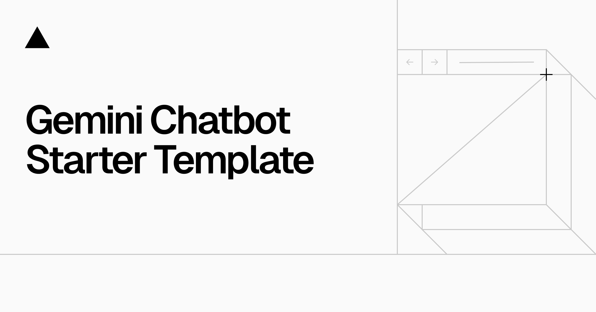

<!-- <a href="https://chat.vercel.ai/">
  
  <h1 align="center">Next.js Gemini Chatbot</h1>
</a>

<p align="center">
  An Open-Source AI Chatbot Template Built With Next.js and the AI SDK by Vercel.
</p>

<p align="center">
  <a href="#features"><strong>Features</strong></a> ·
  <a href="#model-providers"><strong>Model Providers</strong></a> ·
  <a href="#deploy-your-own"><strong>Deploy Your Own</strong></a> ·
  <a href="#running-locally"><strong>Running locally</strong></a>
</p>
<br/>

## Features

- [Next.js](https://nextjs.org) App Router
  - Advanced routing for seamless navigation and performance
  - React Server Components (RSCs) and Server Actions for server-side rendering and increased performance
- [AI SDK](https://sdk.vercel.ai/docs)
  - Unified API for generating text, structured objects, and tool calls with LLMs
  - Hooks for building dynamic chat and generative user interfaces
  - Supports Google (default), OpenAI, Anthropic, Cohere, and other model providers
- [shadcn/ui](https://ui.shadcn.com)
  - Styling with [Tailwind CSS](https://tailwindcss.com)
  - Component primitives from [Radix UI](https://radix-ui.com) for accessibility and flexibility
- Data Persistence
  - [Vercel Postgres powered by Neon](https://vercel.com/storage/postgres) for saving chat history and user data
  - [Vercel Blob](https://vercel.com/storage/blob) for efficient object storage
- [NextAuth.js](https://github.com/nextauthjs/next-auth)
  - Simple and secure authentication

## Model Providers

This template ships with Google Gemini `gemini-1.5-pro` models as the default. However, with the [AI SDK](https://sdk.vercel.ai/docs), you can switch LLM providers to [OpenAI](https://openai.com), [Anthropic](https://anthropic.com), [Cohere](https://cohere.com/), and [many more](https://sdk.vercel.ai/providers/ai-sdk-providers) with just a few lines of code.

## Deploy Your Own

You can deploy your own version of the Next.js AI Chatbot to Vercel with one click:

[](https://vercel.com/new/clone?repository-url=https%3A%2F%2Fgithub.com%2Fvercel-labs%2Fgemini-chatbot&env=AUTH_SECRET,GOOGLE_GENERATIVE_AI_API_KEY&envDescription=Learn%20more%20about%20how%20to%20get%20the%20API%20Keys%20for%20the%20application&envLink=https%3A%2F%2Fgithub.com%2Fvercel-labs%2Fgemini-chatbot%2Fblob%2Fmain%2F.env.example&demo-title=Next.js%20Gemini%20Chatbot&demo-description=An%20Open-Source%20AI%20Chatbot%20Template%20Built%20With%20Next.js%20and%20the%20AI%20SDK%20by%20Vercel.&demo-url=https%3A%2F%2Fgemini.vercel.ai&stores=[{%22type%22:%22postgres%22},{%22type%22:%22blob%22}])

## Running locally

You will need to use the environment variables [defined in `.env.example`](.env.example) to run Next.js AI Chatbot. It's recommended you use [Vercel Environment Variables](https://vercel.com/docs/projects/environment-variables) for this, but a `.env` file is all that is necessary.

> Note: You should not commit your `.env` file or it will expose secrets that will allow others to control access to your various Google Cloud and authentication provider accounts.

1. Install Vercel CLI: `npm i -g vercel`
2. Link local instance with Vercel and GitHub accounts (creates `.vercel` directory): `vercel link`
3. Download your environment variables: `vercel env pull`

```bash
pnpm install
pnpm dev
```

Your app template should now be running on [localhost:3000](http://localhost:3000/). -->

# Multimodal Magic: Transforming Text, Speech, and Visuals

This November, take your coding to the next level by building apps that transform text, speech, and visuals into immersive experiences – it's time to blend modes and create magic across dimensions!

## Project Overview

Multimodal Magic is an innovative application that seamlessly integrates text, speech, and visual inputs to create an immersive user experience. This project demonstrates how different modalities can interact to provide a cohesive and engaging interface.

### Workflow

1. **Input**:

   - **Text**: Users can input text via a text area.
   - **Speech**: Users can use speech recognition to input text.
   - **Visuals**: Users can upload images or other files.

2. **Processing**:

   - **Text Processing**: The input text is processed and displayed in the chat interface.
   - **Speech Processing**: Speech input is converted to text and displayed.
   - **Visual Processing**: Uploaded images are previewed and can be analyzed.

3. **Output**:
   - **Text Output**: Processed text is displayed in the chat interface.
   - **Speech Output**: Text can be converted to speech and played back.
   - **Visual Output**: Uploaded images are displayed and can be interacted with.

### Interaction Between Modalities

- Users can switch between text and speech input seamlessly.
- Uploaded images can be referenced in text or speech inputs.
- The application provides feedback through text and speech outputs, creating a dynamic and interactive experience.

## Installation Guide

Follow these steps to set up and run the project locally:

### Prerequisites

- Node.js (>= 18.0.0)
- npm or pnpm

### Step-by-Step Instructions

1. **Clone the Repository**:

   ```bash
   git clone https://github.com/your-username/multimodal-magic.git
   cd multimodal-magic
   ```

2. **Install Dependencies**:

   ```bash
   pnpm install
   ```

3. **Set Up Environment Variables**:
   - Create a

.env

file in the root directory.

- Add the following environment variables:
  ```env
  GOOGLE_GENERATIVE_AI_API_KEY=your-google-api-key
  AUTH_SECRET=your-auth-secret
  ```

4. **Run the Development Server**:

   ```bash
   pnpm dev
   ```

5. **Open the Application**:
   - Open your browser and navigate to [http://localhost:3000](http://localhost:3000).

### Third-Party APIs and Dependencies

- **Google Generative AI**: Used for advanced text processing.
- **SpeechRecognition**: Used for speech-to-text conversion.
- **Next.js**: Framework for building the application.
- **Tailwind CSS**: For styling the application.
- **Radix UI**: For accessible and flexible UI components.

## Screenshots

### Text Input


### Speech Input


### Image Upload


### Text Output


### Speech Output


## Live Demo

Check out the live demo of the application [here](https://your-live-demo-url.com).

## Important Notes

- Ensure all environment variables are correctly set up.
- Double-check all dependencies and third-party API integrations.
- Missing documentation, unclear instructions, or incomplete project files may result in a lower evaluation score, so double-check everything before submitting!

---

By following this guide, you should be able to set up and run the Multimodal Magic project locally, explore its features, and understand how different modalities interact to create an immersive user experience. Happy coding!
