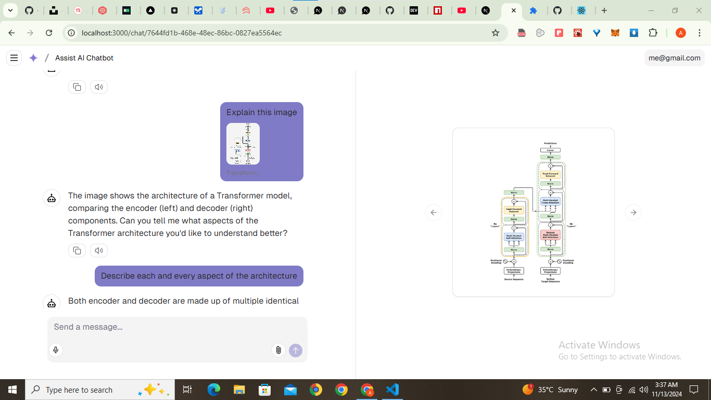

# Assist AI: Transforming Text, Speech, and Visuals

This is a coding challenge project to build apps that transform text, speech, and visuals into immersive experiences – it's time to blend modes and create magic across dimensions!

## Project Overview

Assist AI is an innovative application that seamlessly integrates text, speech, and visual inputs to create an immersive user experience. This project demonstrates how different modalities can interact to provide a cohesive and engaging interface.

### Workflow

1. **Input**:

   - **Text**: Users can input text via the chatbot text area.
   - **Speech**: Users can use speech recognition to input text.
   - **Visuals**: Users can upload images or other files to interact with the chatbot.

2. **Processing**:

   - **Text Processing**: The input text is processed and displayed in the chat interface.
   - **Speech Processing**: Speech input is converted to text and append to the previous input text.
   - **Visual Processing**: Uploaded images can be previewed for further analysis and user experience.

3. **Output**:

   - **Text Output**: Processed text is displayed in the chat interface.
   - **Speech Output**: Chatbot Text output can be converted to speech and played back.
   - **Visual Output**: Uploaded images can also be previewed for further analysis and user experience interaction.

4. **Coprehensive Preview**:
   - **You can also have a comprehensive preview of the attachments while chatting**

### Interaction Between Modalities

- Users can switch between text and speech input seamlessly.
- Uploaded images can be referenced in text or speech inputs.
- The application provides feedback through text and speech outputs, creating a dynamic and interactive experience.

## Installation Guide

Follow these steps to set up and run the project locally:

### Prerequisites

- Node.js (>= 18.0.0)
- npm or pnpm

### Step-by-Step Instructions

1. **Clone the Repository**:

   ```bash
   git clone https://github.com/fullendmaestro/assist-ai.git
   cd multimodal-magic
   ```

2. **Install Dependencies**:

   ```bash
   pnpm install
   ```

3. **Set Up Environment Variables**:
   You will need to use the environment variables [defined in `.env.example`](.env.example). It's recommended you use [Vercel Environment Variables](https://vercel.com/docs/projects/environment-variables) for this, but a `.env` file is all that is necessary.

   > Note: You should not commit your `.env` file or it will expose secrets that will allow others to control access to your various Google Cloud and authentication provider accounts.

   - Make sure your (.env) file contains the following environment variables:

   ```env
   GOOGLE_GENERATIVE_AI_API_KEY=your-google-api-key
   AUTH_SECRET=your-auth-secret
   BLOB_READ_WRITE_TOKEN=your-vercel-blob-token
   POSTGRES_URL=your-postgres-database-url
   ```

   > Note: Follow the following steps to get access to your vercel related environment variables.

   1. Install Vercel CLI: `npm i -g vercel`
   2. Link local instance with Vercel and GitHub accounts (creates `.vercel` directory): `vercel link`
   3. Download your environment variables: `vercel env pull`

4. **Migrate to your database**:

   ```bash
   npx drizzle-kit push
   ```

5. **Run the Development Server**:

   ```bash
   pnpm dev
   ```

6. **Open the Application**:
   - Open your browser and navigate to [http://localhost:3000](http://localhost:3000).

### Third-Party APIs and Dependencies

- [Next.js](https://nextjs.org) App Router
  - Advanced routing for seamless navigation and performance
  - React Server Components (RSCs) and Server Actions for server-side rendering and increased performance
- **[AI SDK](https://sdk.vercel.ai/docs)**:
  - Unified API for generating text, structured objects, and tool calls with LLMs
  - Hooks for building dynamic chat and generative user interfaces
  - Supports Google (default), OpenAI, Anthropic, Cohere, and other model providers
- **[shadcn/ui](https://ui.shadcn.com)**
  - Styling with [Tailwind CSS](https://tailwindcss.com)
  - Component primitives from [Radix UI](https://radix-ui.com) for accessibility and flexibility
- **Data Persistence**
  - [Vercel Postgres powered by Neon](https://vercel.com/storage/postgres) for saving chat history and user data
  - [Vercel Blob](https://vercel.com/storage/blob) for efficient object storage
- **[NextAuth.js](https://github.com/nextauthjs/next-auth)**
  - Simple and secure authentication
- **SpeechRecognition**:
  - [Web Speech API](https://developer.mozilla.org/en-US/docs/Web/API/Web_Speech_API) for text to speech.
  - [React Speech Recognition](https://github.com/JamesBrill/react-speech-recognition) for speech to text. It also uses the `web speech api` internally.
- **Next.js**: Framework for building the application.

## Screenshots

### Chat Interface



### Text Input


### Speech Input


### Image Upload


### Text Output


### Speech Output


## Live Demo

Check out the live demo of the application [here](https://your-live-demo-url.com).

## Important Notes

- Ensure all environment variables are correctly set up.
- Double-check all dependencies and third-party API integrations.

---

By following this guide, you should be able to set up and run the assist-ai project locally, explore its features, and understand how different modalities interact to create an immersive user experience. Happy coding!
